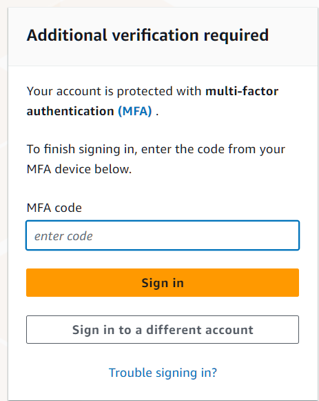
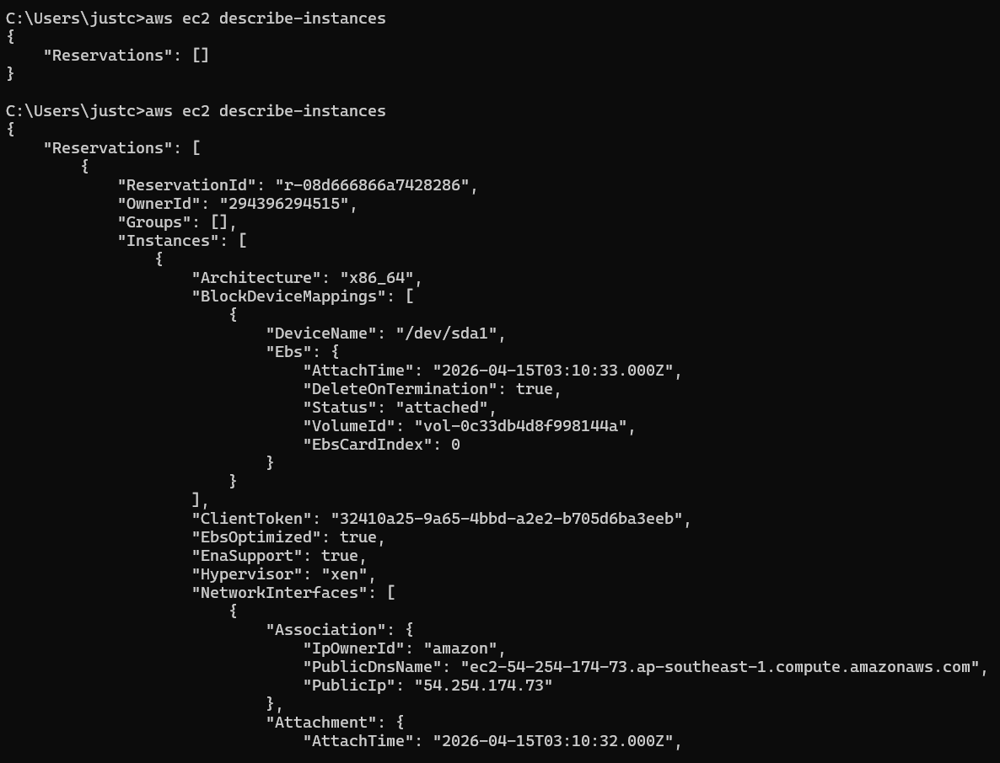
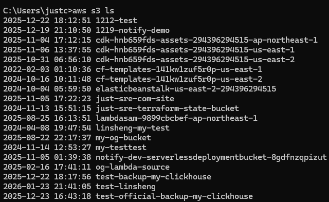
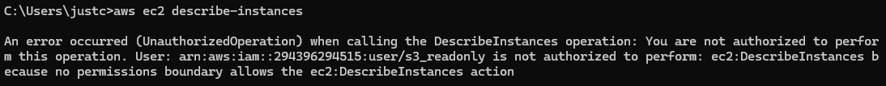
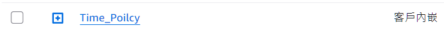
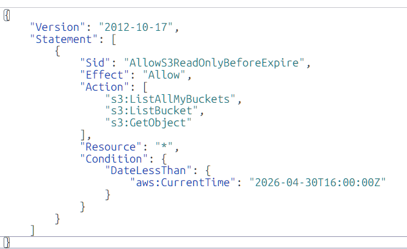
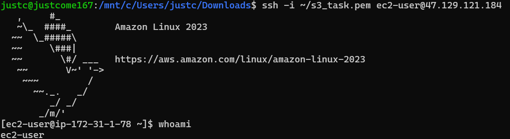
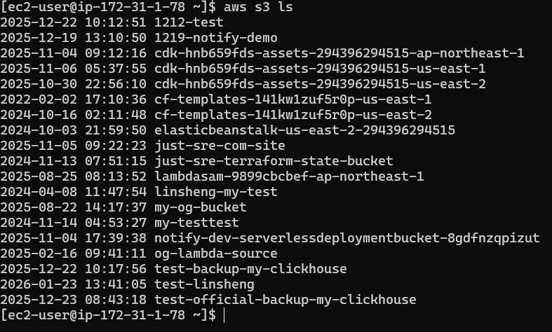

# 【問答題】
## Q1: root user 跟 iam user 的差別？  
A1:  
root user -> 擁有帳號所有資源及最高權限
iam user -> 由root user創造之個別用戶

## Q2: user, group, role, policy 彼此間的關係為何？policy 的格式為何？  
A2:  
group = 用於管理具有相同權限的user，所以大家的policy是一樣的  
role = 提供 AWS 服務或是其他帳戶使用的暫時權限，透過附加 policy 來定義可執行的動作  
policy 本身不會直接生效，必須附加到 User、Group 或 Role ，格式為JSON  

# 【實作題】
## 1. 為 root account 創建 MFA 登入。
 

## 2. 創建 aws credential（access key & secret），並且使用 aws cli 嘗試存取 ec2 列表（可以手動創建一台機器）及 s3 列表。

  
使用 AWS CLI 列出 S3 Bucket 清單

  
  
使用 AWS CLI 列出 EC2 清單，上方為尚未啟動個體，下方為以建立啟動個體

  

## 3. 創建一個 user，名為 `s3_readonly`，並且僅給予其 s3 readonly 的權限，為此 user 創建 credential （憑證） 並且設定在 aws cli 內，使用不同的 profile 可以指定用哪個 credential 跟 aws 溝通，驗證方式為嘗試取得 ec2 及 s3 的列表，其中一個會失敗。

  
使用 AWS CLI 列出 S3 Bucket 清單 (可取得)

   
  
使用 AWS CLI 列出 ec2 清單 (不可取得)

  

## 4. 嘗試創建 inline policy，使 s3_readonly 這個使用者在某個時間後就無法存取 s3，並且回答 inline policy 可以用在哪些地方。
**Inline Policy 是「直接綁在某一個 IAM 身分上的專屬 Policy」，不能重複使用也不能被數個使用者共用(但是可以綁在Group，底下的User會間接受影響)。**

  
建立一個 inline policy 

  
  
限制時間至 4/30 的 16:00 

  

  
 inline policy 可以用在 IAM中的 User、Group、Role

## 5. 嘗試創建 EC2，並且為其創建一個 S3ReadOnlyRole 的 role，使 ec2 上可以使用 aws cli（或是 sdk） 存取 s3 資源，並且不需要設定 access key。（這題可以用 aws linux，因為他有內建 aws cli）

  
 ssh 至 EC2 

  
  
 不須 access key 讀取s3 list 

  

