# 嘗試了解 VPC 最基本元件。
## VPC、region、avaliable zones(az), subnet、route table、internet gateway、nat gateway。
<dir>
  
VPC -> 在AWS中租到的私人網路空間

  
region -> 地理區域(e.g. 日本、新加坡...)，每個區域都是獨立的、完全隔離的

  
avaliable zones(AZ) -> 可用區，位於region中的獨立資料中心，一個region會有2~4個AZ

  
subnet -> 子網路，用於存放資源，一個子網路只屬於一個AZ，分為Public Subnet(公共)、Private Subnet(隱藏)

  
route table -> 路由表，每個subnet必須關聯一個route table

  
internet gateway -> 讓VPC直接連上網路(Internet)，沒有這個就無法上網

  
nat gateway -> 讓Private Subnet向外連線，但外部無法主動連進來

</dir>

# 【實作題】
## 1. 在東京 region，嘗試創建一個 VPC，其 CIDR 為 10.0.0.0/18，為其創建兩個 subnet 並且其遮罩長度為 20，並且位於不同的 zone，且提供該兩個 subnet 的 CIDR。
<dir>
  
 sb1 zone: apne1-az4 (ap-northeast-1a) CIDR: 10.0.0.0/20

  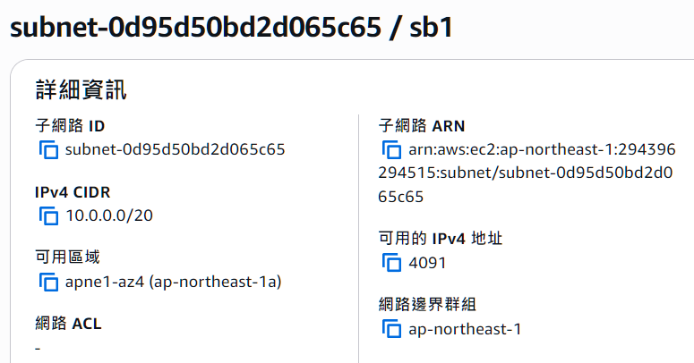
  
 sb2 zone: apne1-az1 (ap-northeast-1c) CIDR: 10.0.16.0/20/20

  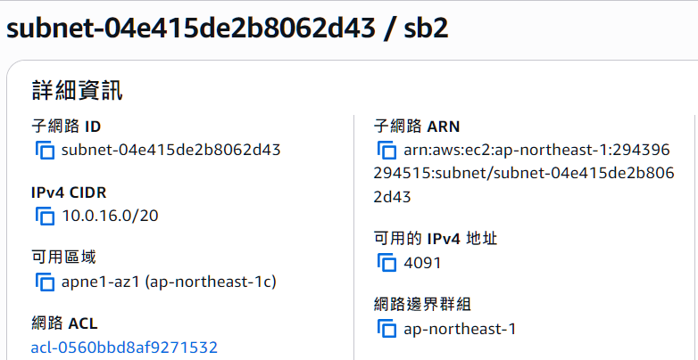
</dir>

## 2. 承第一題，為該兩個 subnet 分別創建一個 route table，使其成為 public 跟 private subnet。
<dir>
  
 public route 

  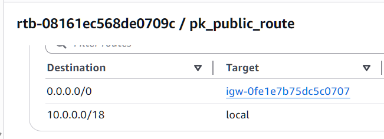
  
 private route 

  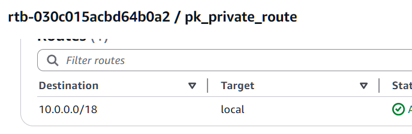
  
 路由 

  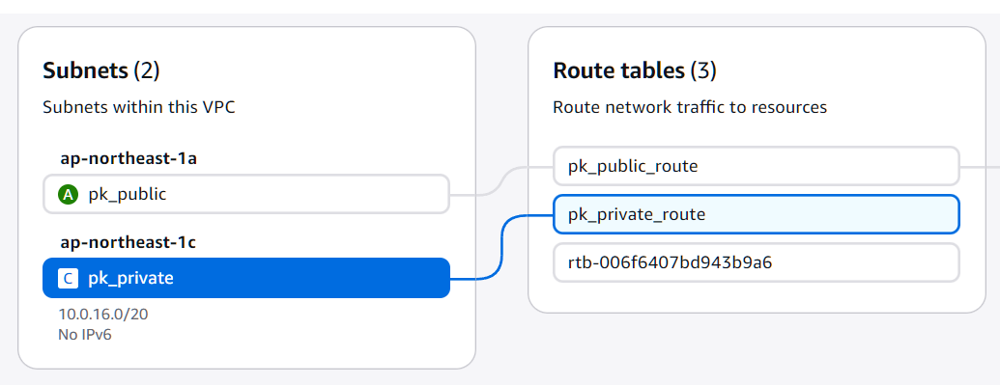
</dir>

## 3. 承第二題，在兩個 subnet 上分別創建一台 ec2，並且使用 ssh 從自己的 laptop 連上此兩台 ec2，提供你的做法。
<dir>
  
 第一種方式：先 SSH 進 Public EC2，再從裡面 SSH 進 Private EC2

  
ubuntu@ip-10-0-0-197:~$ ssh -i pk_ec2p.pem ubuntu@10.0.24.16

  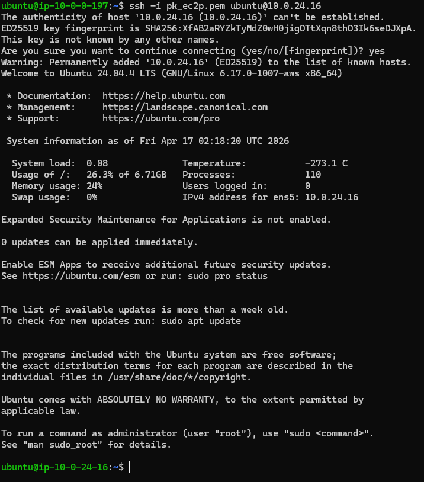
  
 第二種方式：直接從 CMD 使用 ProxyCommand 進 Private EC2 

  

    ssh -i ~/pk_ec2p.pem(KEY) \
  -o "ProxyCommand=ssh -i ~/pk_ec2p.pem(KEY) -W %h:%p ubuntu@18.181.193.111(public IP)" \
  ubuntu@10.0.24.16(private IP)
  ``
  

  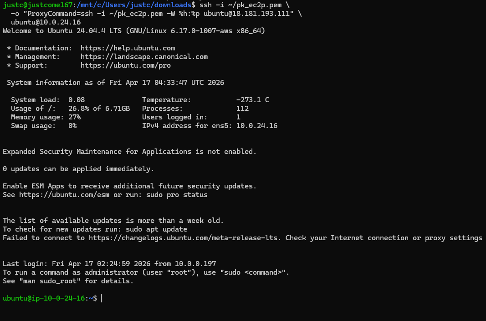
</dir>

## 4. 在 public ec2 上安裝 nginx，並且使用瀏覽器輸入 public ip，取得 nginx 的網頁頁面後截圖。
<dir>
  
 先用sudo apt update

  
`` 

  
來更新套件清單

  
 安裝 Nginx -> sudo apt install -y nginx 

  
 確認 Nginx 服務狀態 -> systemctl status nginx 

  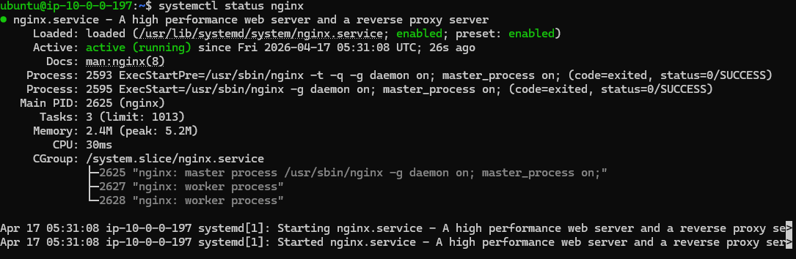
  
  Active: active (running) 成功跑起來了 

  
  
 public 的 SG 要記得設定 HTTP 80 0.0.0.0/ 

  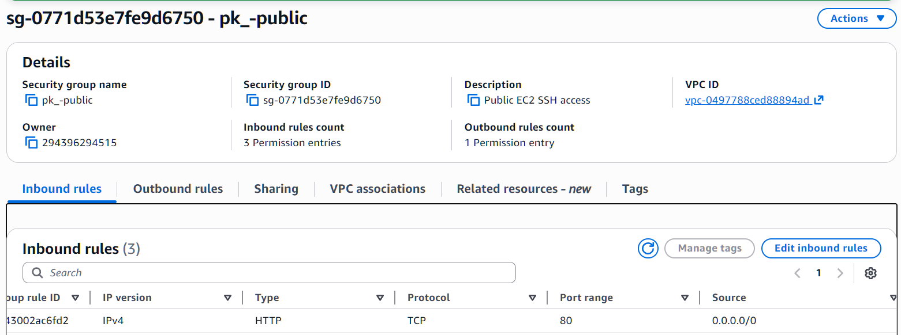
  
  
 成功從本機取得 nginx 的網頁頁面 

  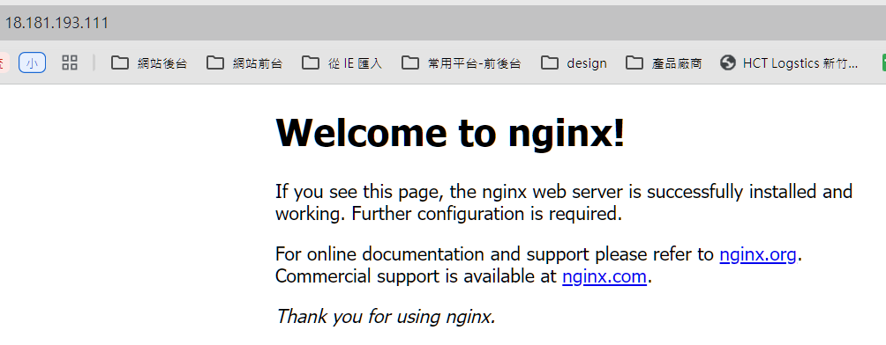
</dir>

## 5. 嘗試在 private 的那台 ec2 上使用 curl google.com 指令，取得回傳的 html 頁面（有回傳就是成功）=> 如何做到？=> 使用 nat gateway
<dir>
  
 Public Subnet 確認有 10.0.0.0/20，有 Internet Gateway 

  
 EC2 -> 建立 Elastic IP （NAT Gateway 必要） 

  
 VPC -> 建立 NAT Gateway Subnet選 public / Elastic IP 選剛剛創的 
 
  
 修改 Private Route -> 加上 0.0.0.0/ 以及 NAT Gateway 

  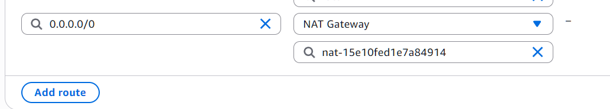
</dir>

<dir>
  
 驗證 curl google.com 

  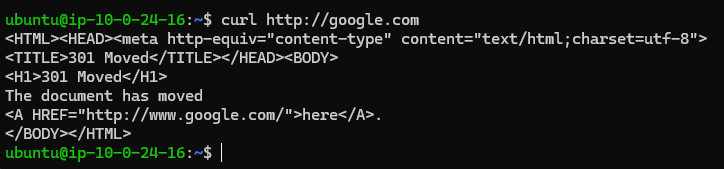
</dir>

 ---
 
**特別警告：NAT Gateway 費用較高，如果有創建，要記得刪除乾淨。**
<dir>
  
 先去 Private Route 將 NAT Gateway 解綁 

  
 Nat Gateway -> Actions -> 刪除 

  
 Elastic IP -> Actions -> 刪除 (可能會沒辦法馬上刪，要等 Nat Gateway 完全關閉才可以刪) 

</dir>

